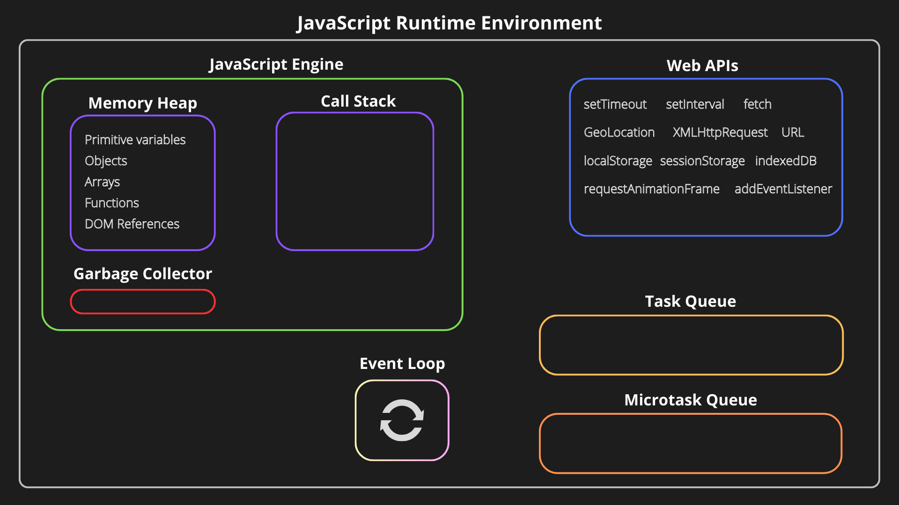

| Index       | Topics |
| ----------- | ------ |
| Javascript  |        |
| Typescript  |        |
| ReactJs     |        |
| Reactnative |        |

# 1. Javascript / Ecmascript

Javascript runs anywhere (but it needs a runtime)   

### Javascript runtime :   
Web browsers have their own engine, like chrome has v8 engine       
Servers require a runtime like nodejs, deno, bun to be installed  

The Event Loop allows js to perform non-blocking, asynchronous operations even though it is single-threaded. 

## Javascript Programming 

1. **Variables** (let, const)
2. **Arrow functions** ()=>{}
3. Array methods (.map, .filter)
4. Destructuring {name, age} 
5. Spread operator ...
6. Promises (async, await)
7. Es6 modules (import/export)

# 2. Typescript

1. **Basic types** (const name:string = "Arjun";)
2. Object types (interface User{name:string; age:number; email?:string;})
3. Typing props (interface ButtonProps{label:string; disabled?:boolean};)
4. Typing useState (const[name, setName]=useState<string>("");)
5. Typing arrays (const tags:string[]=["react", "ts"];)
6. Typing functions (const greet=(userId:number):string=>{return `Hello user ${userId};};)
7. Union types (type Status = "loading" | "success" | "error"; const[status, setStatus]=useState<Status>("loading");)