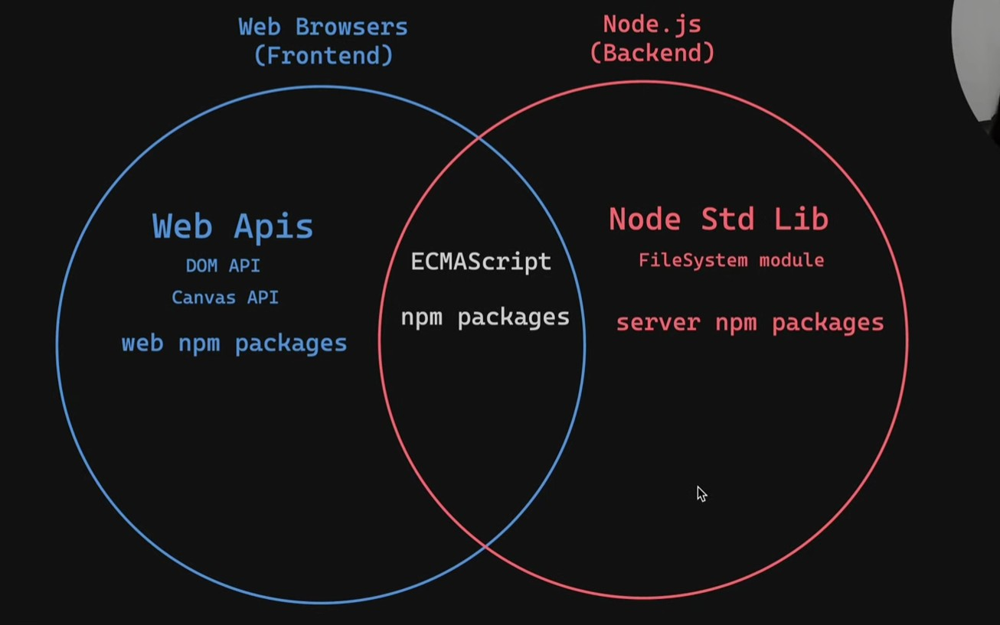

| Index       | Topics |
| ----------- | ------ |
| Javascript  |        |
| Typescript  |        |
| React       |        |
| Reactnative |        |

# 1. Javascript / Ecmascript

Javascript runs anywhere (but it needs a runtime)   


### Javascript runtime :   
Web browsers have their own engine, like chrome has v8 engine       
Servers require a runtime like nodejs, deno, bun to be installed  


The Event Loop allows js to perform non-blocking, asynchronous operations even though it is single-threaded. 

## Javascript Programming 

1. **Variables** (let, const)
2. **Arrow functions** ()=>{}
3. **Array methods** (.map, .filter)
4. **Destructuring** {name, age} 
5. **Spread operator** ...
6. **Promises** (async, await)
7. **Es6 modules** (import/export)


# 2. Typescript

1. **Basic types** (const name:string = "Arjun";)
2. **Object types** (interface User{name:string; age:number; email?:string;})
3. **Typing props** (interface ButtonProps{label:string; disabled?:boolean};)
4. **Typing useState** (const[name, setName]=useState<string>("");)
5. **Typing arrays** (const tags:string[]=["react", "ts"];)
6. **Typing functions** (const greet=(userId:number):string=>{return `Hello user ${userId};};)
7. **Union types** (type Status = "loading" | "success" | "error"; const[status, setStatus]=useState<Status>("loading");)


# 3. React

1. **Components** : Everything is a component. A component is just a function that returns UI. 
   ```javascript
   const Greeting = () => {
      return <Text>Hello Handsome!</Text>;
   };
   ```

2. **Props** : How you pass data into a component.
   ```javascript
   // Define
   const Greeting = ({ name }) => {
      return <Text>Hello {name}!</Text>;
   };

   // Use
   <Greeting name="Priya" />
   <Greeting name="Arjun" />
   ```

3. **useState** : How you store data that can change and re-render the UI.
   ```javascript
   const Counter = () => {
      const [count, setCount] = useState(0);

      return (
         <View>
            <Text>{count}</Text>
            <Button title="Add" onPress={() => setCount(count + 1)} />
         </View>
      );
   };

   ```

4. **useEffect** : Runs code when the component loads or when something changes. Used for API calls.
   ```javascript
   const Profile = () => {
      const [user, setUser] = useState(null);

      useEffect(() => {
         fetch("https://api.example.com/user/1")
            .then((res) => res.json())
            .then((data) => setUser(data));
      }, []); // [] = run once on load

      return <Text>{user?.name}</Text>;
   };
   ```
5. **List with map** : How you render arrays of data
   ```javascript
   const fruits = ["Mango", "Banana", "Guava"];

   const FruitList = () => {
      return (
         <View>
            {fruits.map((fruit) => (
               <Text key={fruit}>{fruit}</Text>
            ))}
         </View>
      );
   };
   ```
6. **Conditional Rendering** : Show or hide UI based on state.
   ```javascript
   const App = () => {
      const [isLoggedIn, setIsLoggedIn] = useState(false);

      return (
         <View>
            {isLoggedIn ? <Text>Welcome back!</Text> : <Text>Please log in</Text>}
         </View>
      );
   };
   ```

7. **Handling Events** : Responding to user actions like button presses.
   ```javascript
   const LoginButton = () => {
      const handlePress = () => {
         console.log("Pressed!");
      };

      return <Button title="Login" onPress={handlePress} />;
   };
   ```
8. **Lifting State Up** : When two components need to share data, move the state to their parent.
   ```javascript
   const Parent = () => {
      const [name, setName] = useState("");

      return (
         <View>
            <Input onChangeText={setName} />   {/* child updates state */}
            <Greeting name={name} />           {/* other child reads state */}
         </View>
      );
   };
   ```
